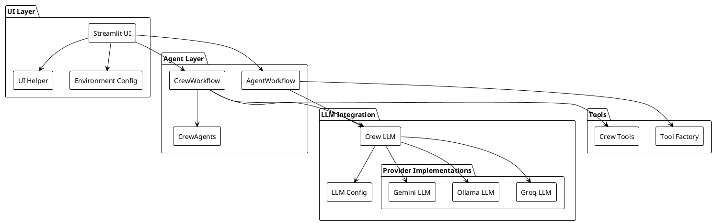
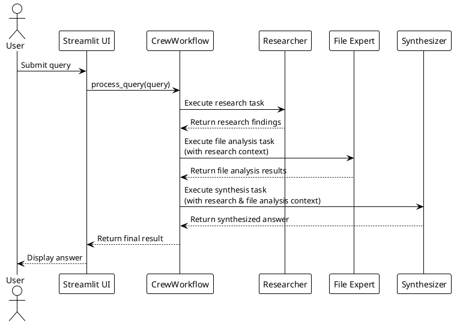

# AI Agent Framework

A powerful multi-agent system for building, orchestrating, and leveraging AI agents across various domains. The current implementation features a search assistant powered by multiple specialized AI agents working together.

## Table of Contents

- [Overview](#overview)
- [Current Implementation: Multi-Agent Search Assistant](#current-implementation-multi-agent-search-assistant)
  - [Architecture](#architecture)
  - [Workflow](#workflow)
  - [Diagrams](#diagrams)
- [Modules](#modules)
  - [UI Component](#1-ui-component-utilsui_helperpy)
  - [Agent System](#2-agent-system)
  - [LLM Integration](#3-llm-integration)
  - [Tools System](#4-tools-system)
- [Configuration](#configuration)
- [Roadmap](#roadmap)
  - [GitHub Integration](#1-github-integration)
  - [Web & Content Integration](#2-web--content-integration)
  - [Code Execution & Data Exploration](#3-code-execution--data-exploration)
  - [Additional Integrations](#4-additional-integrations)
- [Setup and Installation](#setup-and-installation)
- [Requirements](#requirements)
- [Technical Details](#technical-details)

## Overview

The AI Agent Framework is designed to be a comprehensive platform for building, managing, and leveraging AI agents across various domains including development, health, finance, and more. The framework enables the creation of specialized agents that can work independently or collaboratively to solve complex problems.

This repository represents the initial implementation of what will become a much broader system with capabilities spanning from code analysis and GitHub integration to data visualization and specialized tool integration.

## Current Implementation: Multi-Agent Search Assistant

The first implementation in this framework is a Multi-Agent Search Assistant that leverages multiple specialized AI agents to process search queries more effectively than a single agent could. The system uses CrewAI for agent coordination and orchestration, coupled with a variety of tools for web search, document retrieval, and data analysis.

### Architecture

The application follows a modular architecture with several key components:

#### Core Components

1. **UI Layer (Streamlit)**: Handles user interaction, displays chat messages, and provides configuration options.
2. **Agent Layer (CrewAI)**: Coordinates multiple specialized agents to process queries effectively.
3. **LLM Integration**: Supports multiple LLM providers (Gemini, Ollama, Groq) with a unified interface.
4. **Tools System**: Provides agents with capabilities like web search, file reading, and knowledge retrieval.

### Workflow

When a user submits a query:

1. The query is passed to a crew of agents (Researcher, File Expert, Synthesizer)
2. Each agent processes the query using its specialized capabilities
3. The synthesizer agent combines results into a comprehensive answer
4. The answer is displayed to the user in the chat interface

### Diagrams

#### System Architecture


<details>
<summary>System Architecture</summary>



</details>

#### Agent Interaction Flow


<details>
<summary>Agent Interaction Flow Diagram</summary>




</details>

## Modules

### 1. UI Component (`utils/ui_helper.py`)
- Handles chat message display and user interaction
- Manages session state for consistent user experience
- Provides configuration UI for LLM providers and settings

### 2. Agent System
- **CrewWorkflow** (`agents/crew_workflow.py`): Orchestrates the CrewAI-based multi-agent system
- **AgentWorkflow** (`agents/workflow.py`): Alternative workflow using LangGraph for agent orchestration
- **CrewAgents** (`agents/crew_agents.py`): Defines specialized agents with different roles and capabilities

### 3. LLM Integration
- **LLM Config** (`config/llm_config.py`): Manages LLM provider configuration
- **Crew LLM** (`llm/crew_llm.py`): Creates LLM instances for CrewAI
- Provider-specific implementations for Gemini, Groq, and Ollama

### 4. Tools System
- **ToolFactory** (`tools/__init__.py`): Creates and manages tool instances
- **CrewTools** (`tools/crew_tools.py`): Defines tools available to agents

## Configuration

The application supports multiple LLM providers:

1. **Ollama**: Local LLM running on `http://localhost:11434`
2. **Gemini**: Google's Gemini models via API
3. **Groq**: Fast inference API for various open models

Configuration is managed through:
- Environment variables (.env file)
- UI-based configuration (settings saved in session state)

## Roadmap

This AI Agent Framework is designed to grow into a comprehensive platform with capabilities spanning multiple domains. Here's the planned roadmap:

### 1. GitHub Integration

- **Repository Management**:
  - Search Repositories: Query GitHub to find repositories based on keywords, topics, or user/organization
  - Access Notifications: Retrieve and manage GitHub notifications
  - Issue Analysis: Scan repositories to summarize and categorize issues
  - Fork & Commit: Create forks and commit changes programmatically
  - Pull Request Status: Check and report on pull request status

### 2. Web & Content Integration

- **Web Search & Parsing**:
  - General Web Search: Perform web searches using integrated NewsAPI
  - Medium Blog Integration: Search and parse Medium blogs, including premium content
  - Dynamic RAG Memory: Extend the assistant's RAG memory with extra context based on search results

- **Documentation Summaries**:
  - Medium Blogs: Generate concise summaries of blog posts
  - GitHub READMEs: Summarize key sections of repository documentation

### 3. Code Execution & Data Exploration

- **Coding Capabilities**:
  - Code Writing & Execution: Write, execute, and debug code snippets across languages
  - SQL Query Generation: Create and execute SQL queries from natural language
  - Data Visualization: Generate visualizations from data with RAG support

### 4. Additional Integrations

- **Spotify Integration**:
  - Access and manage user Spotify playlists
  - Provide playlist analysis and recommendations

- **CodeForces Integration**:
  - Run complex queries to analyze contest performances
  - Explain solutions and provide problem-solving insights

## Setup and Installation

1. Clone the repository
2. Install requirements:
   ```
   pip install -r requirements.txt
   ```
3. Configure your .env file with API keys
4. Run the application:
   ```
   streamlit run src/app.py
   ```

## Requirements

- Python 3.9+
- Streamlit
- CrewAI
- LangGraph (for alternative workflow)
- API keys for selected LLM providers

## Technical Details

The application leverages:
- **CrewAI** for agent orchestration
- **Streamlit** for the web interface
- **Pydantic** for data validation
- **LangGraph** for workflow management (alternative implementation)
